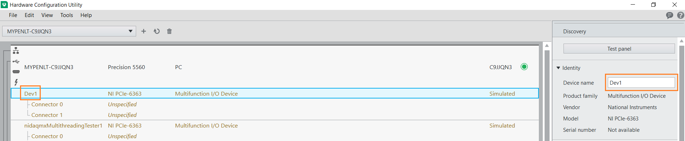
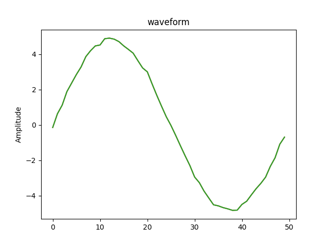

===========  =================================================================================================================================
Info         Contains a Python API for interacting with NI-DAQmx. See `GitHub <https://github.com/ni/nidaqmx-python/>`_ for the latest source.
Author       National Instruments
===========  =================================================================================================================================

About
=====

The **nidaqmx** package contains an API (Application Programming Interface)
for interacting with the NI-DAQmx driver. The package is implemented in Python.
The package is implemented as a complex,
highly object-oriented wrapper around the NI-DAQmx C API using the
`ctypes <https://docs.python.org/2/library/ctypes.html>`_ Python library.

**nidaqmx** supports all versions of the NI-DAQmx driver that ships with the C
API. The C API is included in any version of the driver that supports it. The
**nidaqmx** package does not require installation of the C header files.

Some functions in the **nidaqmx** package may be unavailable with earlier
versions of the NI-DAQmx driver. Visit the
`ni.com/downloads <http://www.ni.com/downloads/>`_ to upgrade your version of
NI-DAQmx.

**nidaqmx** supports Windows and Linux operating systems where the NI-DAQmx
driver is supported. Refer to
`NI Hardware and Operating System Compatibility <https://www.ni.com/r/hw-support>`_
for which versions of the driver support your hardware on a given operating
system.

**nidaqmx** supports CPython 3.8+ and PyPy3.

Installation
============

Running **nidaqmx** requires NI-DAQmx to be installed. Visit
`ni.com/downloads <http://www.ni.com/downloads/>`_ to download the latest
version of NI-DAQmx. None of the recommended **Additional items** are required
for **nidaqmx** to function, and they can be removed to minimize installation
size. It is recommended you continue to install the **NI Certificates** package
to allow your Operating System to trust NI built binaries, improving your
software and hardware installation experience.

**nidaqmx** can be installed with `pip <http://pypi.python.org/pypi/pip>`_::

  $ python -m pip install nidaqmx

Similar Packages
================

There are similar packages available that also provide NI-DAQmx functionality in
Python:

- `daqmx <https://pypi.org/project/daqmx/>`_
  (`slightlynybbled/daqmx on GitHub <https://github.com/slightlynybbled/daqmx>`_)
  provides an abstraction of NI-DAQmx in the ``ni`` module.

- PyLibNIDAQmx (`pearu/pylibnidaqmx on GitHub <https://github.com/pearu/pylibnidaqmx>`_)
  provides an abstraction of NI-DAQmx in the ``nidaqmx`` module, which collides
  with this package's module name.

Getting Started
===============

In order to use the **nidaqmx** package, you must have at least one DAQ device installed on your
machine. X series DAQ device (eg: PCIe-6363 or USB-6351) is recommended, physical or
simulated devices are supported. You can use the **NI MAX** or **NI Hardware Configuration Utility**
to verify and configure your devices.

Verify and configure devices on **NI MAX**:

.. image:: max_device_name.png
  :alt: NI MAX Device Name
  :align: center
  :width: 800px

Verify and configure devices on **NI Hardware Configuration Utility**:

Virtual channels and tasks are fundamental components of NI-DAQmx.

Task in NI-DAQmx
----------------
A task is a collection of one or more virtual channels with timing, triggering, and other properties.
Refer to the `NI-DAQmx Task <https://www.ni.com/docs/en-US/bundle/ni-daqmx/page/tasksnidaqmx.html>`_ for more information.

Example code to create a task:

.. code-block:: python

  >>> import nidaqmx
  >>> with nidaqmx.Task() as task:
  ...     pass

Virtual Channels in NI-DAQmx
----------------------------
Virtual channels, or sometimes referred to generically as channels, are software entities that encapsulate the physical channel
along with other channel specific information—range, terminal configuration, and custom scaling—that formats the data.
Refer to the `NI-DAQmx Channel <https://www.ni.com/docs/en-US/bundle/ni-daqmx/page/chans.html>`_ for more information.

Example code to create a task to read data from an analog input channel:

.. code-block:: python

  >>> import nidaqmx
  >>> with nidaqmx.Task() as task:
  ...     ai_channel = task.ai_channels.add_ai_voltage_chan("Dev1/ai0")
  ...     ai_channel.ai_min = -10.0
  ...     ai_channel.ai_max = 10.0
  ...     task.read()
  ...
  -0.14954069643238624

Example code to create a task to read data from two analog input channels:

.. code-block:: python

  >>> import nidaqmx
  >>> with nidaqmx.Task() as task:
  ...     ai_channel_1 = task.ai_channels.add_ai_voltage_chan("Dev1/ai0")
  ...     ai_channel_2 = task.ai_channels.add_ai_voltage_chan("Dev1/ai1")
  ...     ai_channel_1.ai_min = -5.0
  ...     ai_channel_1.ai_max = 5.0
  ...     ai_channel_2.ai_min = -10.0
  ...     ai_channel_2.ai_max = 10.0
  ...     task.read()
  ...
  [-0.07477034821619312, 0.8642841883602405]

Timing
------
You can use software timing or hardware timing to control when a signal is generated. With hardware timing,
a digital signal, such as a clock on your device, controls the rate of generation. With software timing,
the rate at which the samples are generated is determined by the software and operating system instead of
by the measurement device. A hardware clock can run much faster than a software loop. A hardware clock is
also more accurate than a software loop.
Refer to the `Timing, Hardware Versus Software <https://www.ni.com/docs/en-US/bundle/ni-daqmx/page/hardwresoftwretiming.html>`_ for more information.

Example code to acquire finite amount of data using hardware timing:

.. code-block:: python

  >>> import nidaqmx
  >>> from nidaqmx.constants import AcquisitionType, READ_ALL_AVAILABLE
  >>> with nidaqmx.Task() as task:
  ...     task.ai_channels.add_ai_voltage_chan("Dev1/ai0")
  ...     task.timing.cfg_samp_clk_timing(1000.0, sample_mode=AcquisitionType.FINITE, samps_per_chan=10)
  ...     data = task.read(READ_ALL_AVAILABLE)
  ...     print("Acquired data: [" + ", ".join(f"{value:f}" for value in data) + "]")
  ...
  AIChannel(name=Dev1/ai0)
  Acquired data: [-0.149693, 2.869503, 4.520249, 4.704886, 2.875912, -0.006104, -2.895596, -4.493698, -4.515671, -2.776574]

TDMS Logging
------------
Technical Data Management Streaming (TDMS) is a binary file format that allows for high-speed data logging.
When you enable TDMS data logging, NI-DAQmx can stream data directly from the device buffer to the hard disk.
Refer to the `TDMS Logging <https://www.ni.com/docs/en-US/bundle/ni-daqmx/page/datalogging.html>`_ for more information.

Example code to acquire finite amount of data and log it to a TDMS file:

.. code-block:: python

  >>> import nidaqmx
  >>> from nidaqmx.constants import AcquisitionType, LoggingMode, LoggingOperation, READ_ALL_AVAILABLE
  >>> with nidaqmx.Task() as task:
  ...     task.ai_channels.add_ai_voltage_chan("Dev1/ai0")
  ...     task.timing.cfg_samp_clk_timing(1000.0, sample_mode=AcquisitionType.FINITE, samps_per_chan=10)
  ...     task._in_stream.configure_logging("TestData.tdms", LoggingMode.LOG_AND_READ, operation=LoggingOperation.CREATE_OR_REPLACE)
  ...     data = task.read(READ_ALL_AVAILABLE)
  ...     print("Acquired data: [" + ", ".join(f"{value:f}" for value in data) + "]")
  ...
  AIChannel(name=Dev1/ai0)
  Acquired data: [-0.149693, 2.869503, 4.520249, 4.704886, 2.875912, -0.006104, -2.895596, -4.493698, -4.515671, -2.776574]

Plot Data
---------
You can use the 3rd-party module **matplotlib.pyplot** to plot a waveform for the acquired data.
For more information on how to use **matplotlib.pyplot** module, refer to the
`Pyplot tutorial <https://matplotlib.org/stable/tutorials/pyplot.html#sphx-glr-tutorials-pyplot-py>`_.

Example code to plot waveform for acquired data using **matplotlib.pyplot** module:

.. code-block:: python

  >>> import nidaqmx
  >>> from nidaqmx.constants import AcquisitionType, READ_ALL_AVAILABLE
  >>> import matplotlib.pyplot as plt
  >>> with nidaqmx.Task() as task:
  ...   task.ai_channels.add_ai_voltage_chan("Dev1/ai0")
  ...   task.timing.cfg_samp_clk_timing(1000.0, sample_mode=AcquisitionType.FINITE, samps_per_chan=50)
  ...   data = task.read(READ_ALL_AVAILABLE)
  ...   plt.plot(data)
  ...   plt.ylabel('Amplitude')
  ...   plt.title('waveform')
  ...   plt.show()
  ...
  AIChannel(name=Dev1/ai0)
  [<matplotlib.lines.Line2D object at 0x00000141D7043970>]
  Text(0, 0.5, 'Amplitude')
  Text(0.5, 1.0, 'waveform')

For more information on how to use **nidaqmx** package, refer to **Usage** section below.

.. _usage-section:

Usage
=====
The following is a basic example of using an **nidaqmx.task.Task** object.
This example illustrates how the single, dynamic **nidaqmx.task.Task.read**
method returns the appropriate data type.

.. code-block:: python

  >>> import nidaqmx
  >>> with nidaqmx.Task() as task:
  ...     task.ai_channels.add_ai_voltage_chan("Dev1/ai0")
  ...     task.read()
  ...
  -0.07476920729381246
  >>> with nidaqmx.Task() as task:
  ...     task.ai_channels.add_ai_voltage_chan("Dev1/ai0")
  ...     task.read(number_of_samples_per_channel=2)
  ...
  [0.26001373311970705, 0.37796597238117036]
  >>> from nidaqmx.constants import LineGrouping
  >>> with nidaqmx.Task() as task:
  ...     task.di_channels.add_di_chan(
  ...         "cDAQ2Mod4/port0/line0:1", line_grouping=LineGrouping.CHAN_PER_LINE)
  ...     task.read(number_of_samples_per_channel=2)
  ...
  [[False, True], [True, True]]

A single, dynamic **nidaqmx.task.Task.write** method also exists.

.. code-block:: python

  >>> import nidaqmx
  >>> from nidaqmx.types import CtrTime
  >>> with nidaqmx.Task() as task:
  ...     task.co_channels.add_co_pulse_chan_time("Dev1/ctr0")
  ...     sample = CtrTime(high_time=0.001, low_time=0.001)
  ...     task.write(sample)
  ...
  1
  >>> with nidaqmx.Task() as task:
  ...     task.ao_channels.add_ao_voltage_chan("Dev1/ao0")
  ...     task.write([1.1, 2.2, 3.3, 4.4, 5.5], auto_start=True)
  ...
  5

Consider using the **nidaqmx.stream_readers** and **nidaqmx.stream_writers**
classes to increase the performance of your application, which accept pre-allocated
NumPy arrays.

Following is an example of using an **nidaqmx.system.System** object.

.. code-block:: python

  >>> import nidaqmx.system
  >>> system = nidaqmx.system.System.local()
  >>> system.driver_version
  DriverVersion(major_version=16L, minor_version=0L, update_version=0L)
  >>> for device in system.devices:
  ...     print(device)
  ...
  Device(name=Dev1)
  Device(name=Dev2)
  Device(name=cDAQ1)
  >>> import collections
  >>> isinstance(system.devices, collections.Sequence)
  True
  >>> device = system.devices['Dev1']
  >>> device == nidaqmx.system.Device('Dev1')
  True
  >>> isinstance(device.ai_physical_chans, collections.Sequence)
  True
  >>> phys_chan = device.ai_physical_chans['ai0']
  >>> phys_chan
  PhysicalChannel(name=Dev1/ai0)
  >>> phys_chan == nidaqmx.system.PhysicalChannel('Dev1/ai0')
  True
  >>> phys_chan.ai_term_cfgs
  [<TerminalConfiguration.RSE: 10083>, <TerminalConfiguration.NRSE: 10078>, <TerminalConfiguration.DIFFERENTIAL: 10106>]
  >>> from enum import Enum
  >>> isinstance(phys_chan.ai_term_cfgs[0], Enum)
  True

You can find more examples in `nidaqmx-python examples <https://github.com/ni/nidaqmx-python/tree/master/examples>`_.

Bugs / Feature Requests
=======================

To report a bug or submit a feature request, please use the
`GitHub issues page <https://github.com/ni/nidaqmx-python/issues>`_.

Information to Include When Asking for Help
-------------------------------------------

Please include **all** of the following information when opening an issue:

- Detailed steps on how to reproduce the problem and full traceback, if
  applicable.
- The python version used::

  $ python -c "import sys; print(sys.version)"

- The versions of the **nidaqmx** and numpy packages used::

  $ python -m pip list

- The version of the NI-DAQmx driver used. Follow
  `this KB article <http://digital.ni.com/express.nsf/bycode/ex8amn>`_
  to determine the version of NI-DAQmx you have installed.
- The operating system and version, for example Windows 7, CentOS 7.2, ...

Documentation
=============

Documentation is available `here <http://nidaqmx-python.readthedocs.io>`_.

Additional Documentation
========================

Refer to the `NI-DAQmx Help <http://digital.ni.com/express.nsf/bycode/exagg4>`_
for API-agnostic information about NI-DAQmx or measurement concepts.

NI-DAQmx Help installs only with the full version of NI-DAQmx.

License
=======

**nidaqmx** is licensed under an MIT-style license (see
`LICENSE <https://github.com/ni/nidaqmx-python/blob/master/LICENSE>`_).
Other incorporated projects may be licensed under different licenses. All
licenses allow for non-commercial and commercial use.

**gRPC Features**
For driver APIs that support it, passing a GrpcSessionOptions instance as a
parameter is subject to the NI General Purpose EULA
(`see NILICENSE <https://github.com/ni/nidaqmx-python/blob/master/NILICENSE>`_).